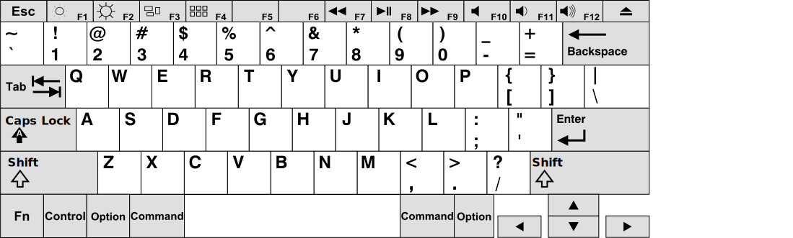
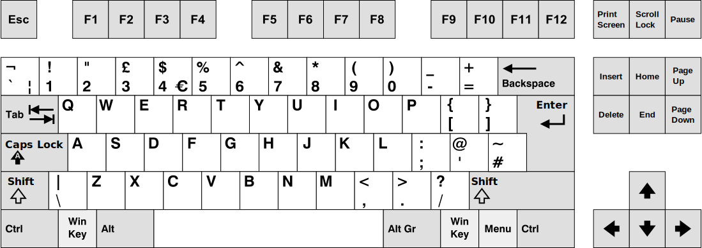
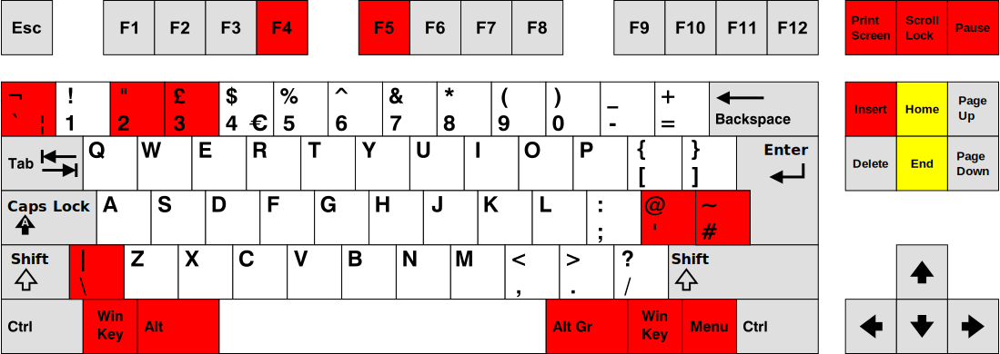

## Mapping Windows Keyboards to OSX

Many people new to programming - including me - learn their lessons on a Mac. MacBooks, with their uniform hardware and UNIX-based operating system, are beloved by coding schools. That said, there's no two ways about it: Apple's keyboards are not the choice of champions. In addition to being costly (even the most basic Magic Keyboard is £99; the full-fat version is an eye-watering £179), like most OEMs Apple's 'boards use membrane switches, giving a mushy press and return. Modern typists after a definitive click, or a particularly obnoxious typewriter-like rattle, have returned to the noisy embrace of the mechanical keyboard.

Maybe you want to use a mechanical keyboard to annoy the neighbours, maybe you want to use some familiar Windows shortcuts, maybe you just don't want to shell out for Apple's seal of approval; either way, you want to use something outside Apple's playground. As you've already discovered this isn't as simple as it should be, but you can be reassured that it's not impossible either.

---

### Software

You'll need a copy of [Karabiner-Elements](https://karabiner-elements.pqrs.org/), a free open-source application intended for exactly this purpose. Check that your version of OSX is supported (anything after 10.15.6 should be OK), that you have Administrator-level permissions on your computer, and download the application from their website. It installs like any other app, but requires permissions you'll have to approve manually. Follow the [official instructions](https://karabiner-elements.pqrs.org/docs/getting-started/installation/) carefully to ensure the app has the permissions it needs.

---

### Keyboard Layouts

There are a number of different types of Mac keyboard, and limitless configurations of Windows ones. For the purposes of this post, I'm mapping a tenkeyless UK-pattern ISO keyboard to an American-market ANSI MacBook Air keyboard. Here are my relative layouts:

<i>MacBook Air International English Keyboard</i>

<i>ISO TKL UK English Keyboard</i>

<small><i>Images modified from Wikipedia and licensed under <a href="https://creativecommons.org/licenses/by-sa/3.0/legalcode">CC BY-SA 3.0</a></i></small>

Here I've highlighted the keys that don't map correctly when the keyboard is plugged into the Mac.

The red keys don't correspond to the Mac's layout, or don't function at all - the Home and End keys do function in the Mac style, but not in the far more useful Windows style; more on that later.
